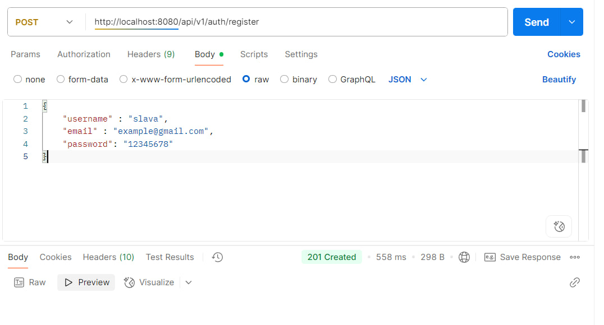
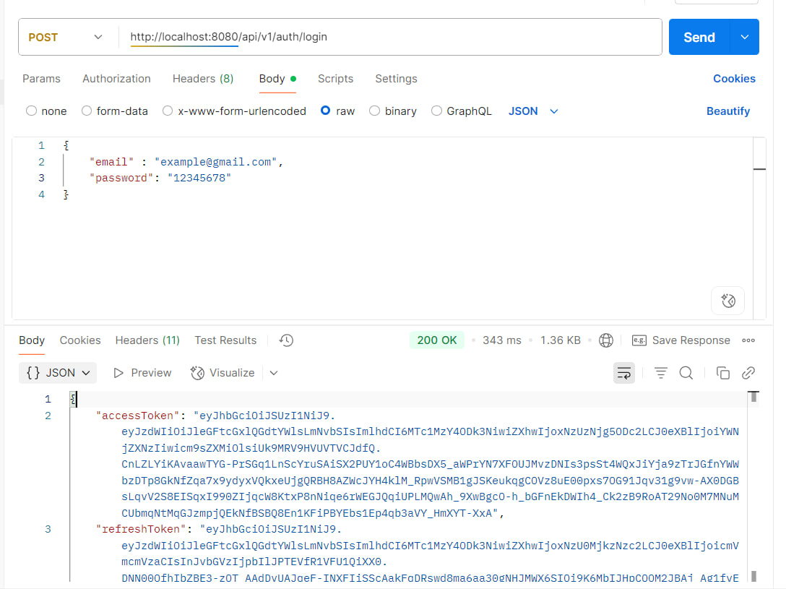
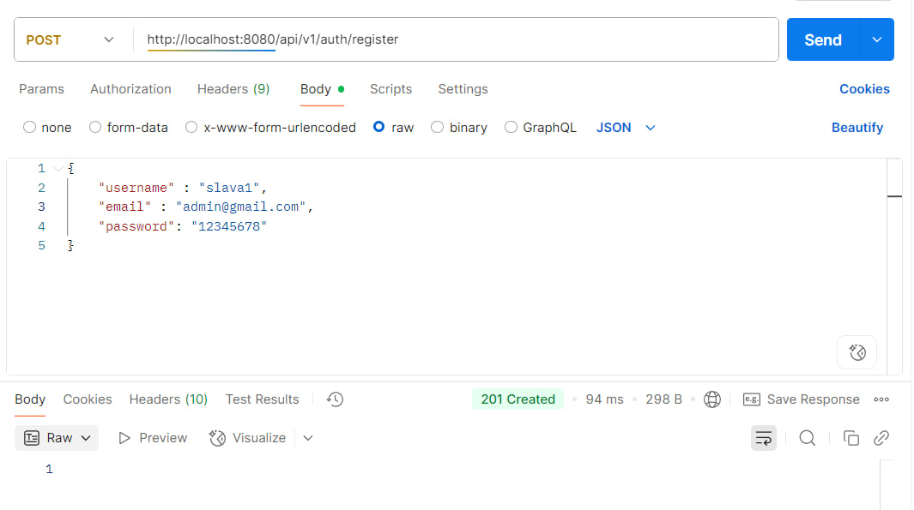
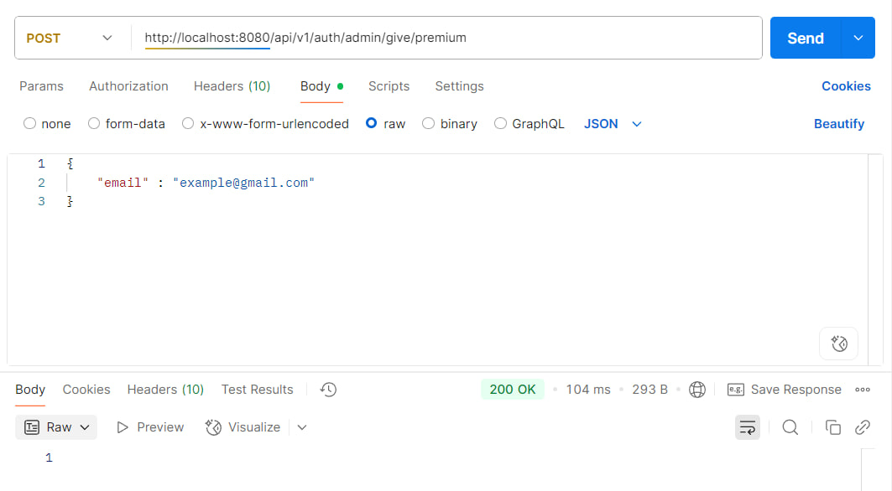
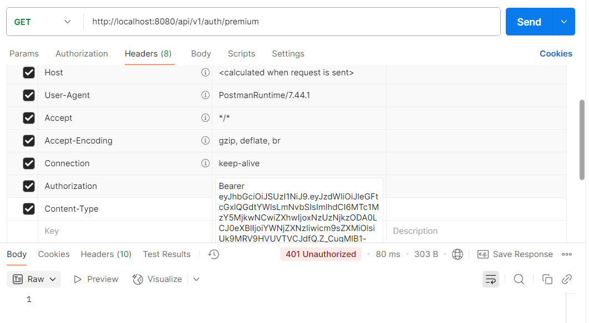

## Auth-service with jws token

Данный сервис выполняет идентификацию,
аутентификацию и авторизацию пользователей

Аутентификация осуществляется при помощи
jws-token

### Быстрый старт:

- Получить private и public keys при помощи
Openssl, выполняйте команды в директории приложениия,
либо указывайте путь до корневой директории приложения:

``openssl genpkey -algorithm RSA -out private.pem -pkeyopt rsa_keygen_bits:2048``

``rsa -pubout -in private.pem -out public.pem``

- Для использования переменных в конфиг файлах
создайте .env файл, поместите туда данные
из файла  .env.example

- Запустите приложение в IDEA,
docker-container с postgres
должен автоматически подняться

### Тестирование приложения

- Зарегистрируем гостя и админа
- залогинемся в аккаунты

- Выдадим от администратара premium роль
пользователю:

- Проверим, что пользователь получил права:

- Попытаемся получить сообщение
о premium статусе до предоставления
роли:

Получили ошибку с кодом 401