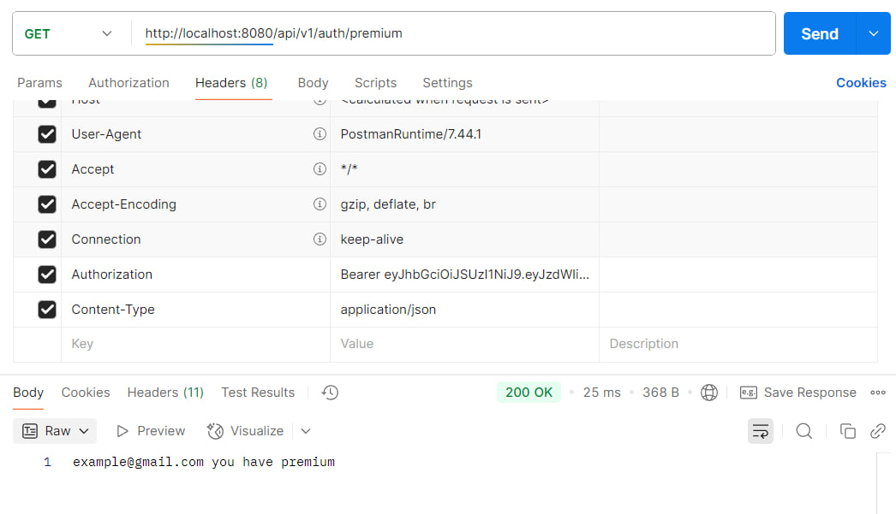

## Auth-service with jwe token

Улучшение hw-4, обеспечение лучшей защиты информации от
компрометации и подмены.

### Задание:

Токен содержит чувствительную информацию и передается
по незащищенному каналу. Необходимо обеспечить защиту
информации как от компрометации,так и от подмены
в том числе участниками обмена.

### Выполнение задания:

- Применение AES-256-GCM шифрования для jwt токена (jwe)

Обеспечение шифрования токена для того, чтобы злоумышленик
не смог прочитать содержимое токена.

Шифрование и дешифрование обеспечивается на сервере.

- Цифровые отпечатки токенов с помощью SHA-256

Привязывает токен к конкретному клиенту.

- Подпись jwt токена при помощи RSA (jws)

Невозможно подменить токен без приватного ключа

- Хранение "черных списков" токенов в кэше  (Redis)

Обеспечивает мгновенный отзыв скомпрометированных токенов.

- Защита от Dos атак

Ограничение количества запросов с одного IP.

### Быстрый старт:

- Получить private и public keys при помощи
Openssl, выполняйте команды в директории приложениия,
либо указывайте путь до корневой директории приложения:

``openssl genpkey -algorithm RSA -out private.pem -pkeyopt rsa_keygen_bits:2048``

``rsa -pubout -in private.pem -out public.pem``

- Для использования переменных в конфиг файлах
создайте .env файл, поместите туда данные
из файла  .env.example

- Запустите приложение в IDEA,
docker-container с postgres и redis
должен автоматически подняться

### Тестирование приложения hw-4

- Зарегистрируем гостя и админа
- залогинемся в аккаунты

- Выдадим от администратара premium роль
пользователю:

- Проверим, что пользователь получил права:

- Попытаемся получить сообщение
о premium статусе до предоставления
роли:

Получили ошибку с кодом 401

### Тестирование приложения hw-5

- Выдадим роль premium пользователю,
теперь нужна подпись токена, токены отправляются
в зашифрованном виде

- Для успешного выполнения запроса, доступного роли premium
нужно также использовать подпись токена и токены в зашифрованном
виде

